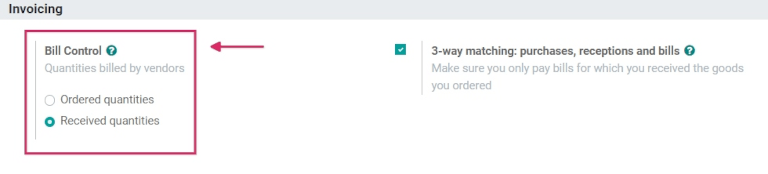
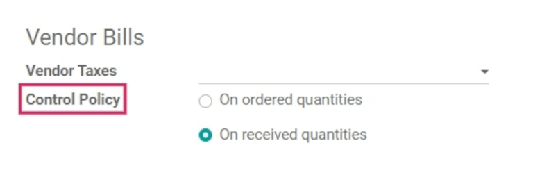
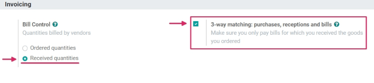
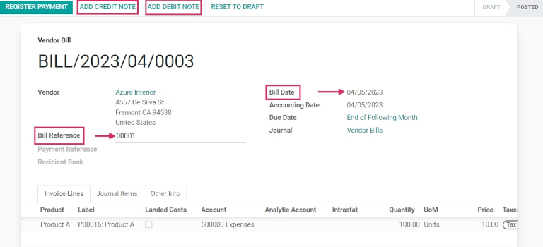
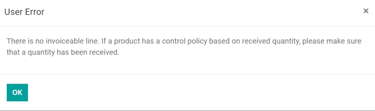
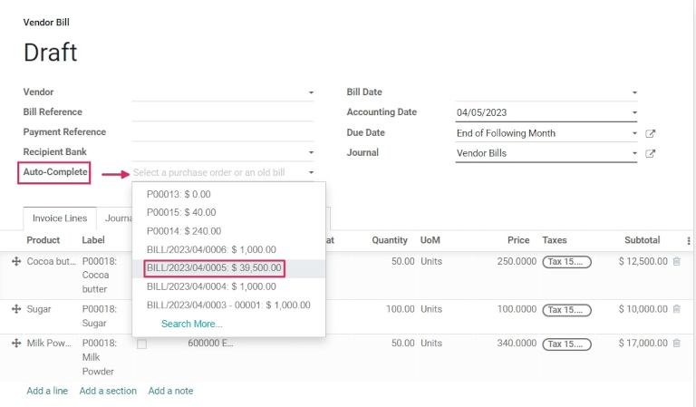
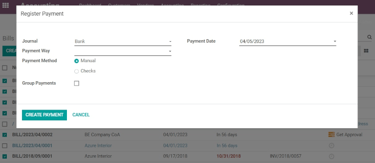

===================
Manage vendor bills
===================

A vendor bill is an invoice received for products and services that a company purchases from a
vendor. Vendor bills record payables as they arrive from vendors, and can include amounts owed for
the goods purchased, sales taxes, freight and delivery charges, and more.

In Odoo, a vendor bill can be created at different points in the purchasing process, depending on
the :guilabel:`Bill Control` policy chosen in the :guilabel:`Purchase` app settings.

Bill control policies
=====================

To view the default bill control policy and make changes, go to :menuselection:`Purchase -->
Configuration --> Settings`, and scroll down to the :guilabel:`Invoicing` section. Here, there are
the two :guilabel:`Bill Control` policy options: :guilabel:`Ordered quantities` and
:guilabel:`Received quantities`.

The policy selected will be the default for any new product created. The definition of each policy
is as follows:

- :guilabel:`Ordered quantities`: creates a vendor bill as soon as a purchase order is confirmed.
  The products and quantities in the purchase order are used to generate a draft bill.
- :guilabel:`Received quantities`: a bill is created only *after* part of the total order has been
  received. The products and quantities *received* are used to generate a draft bill. An error
  message will appear if creation of a vendor bill is attempted without receiving anything.

.. tip::
   If one or two products need a different control policy, the default bill control setting can be
   overridden by going to the :guilabel:`Purchase` tab in a product's template and modifying its
   :guilabel:`Control Policy` field.

3-way matching
--------------

Activating :guilabel:`3-way matching` ensures that vendor bills are only paid once some (or all) of
the products included in the purchase order have actually been received. To activate it, go to
:menuselection:`Purchase --> Configuration --> Settings`, and scroll down to the
:guilabel:`Invoicing` section. Then, click
:guilabel:`3-way matching: purchases, receptions, and bills`.

.. important::
   :guilabel:`3-way matching` is *only* intended to work with the :guilabel:`Bill Control` policy
   set to :guilabel:`Received quantities`.

Create and manage vendor bills on receipts
==========================================

With the bill control policy set to ordered quantities
------------------------------------------------------

To create and manage vendor bills on receipts using the *ordered quantities* bill control policy,
first go to :menuselection:`Purchase --> Configuration --> Settings`, scroll down to the
:guilabel:`Invoicing` section, and select :guilabel:`Ordered quantities`. Then, :guilabel:`Save`
changes.

Next, go to the :guilabel:`Purchase` app and click :guilabel:`Create` to create a new Request for
Quotation (RFQ). Add a :guilabel:`Vendor` to the :abbr:`RFQ (Request for Quotation)`, and add
products to the :guilabel:`Product` lines by clicking :guilabel:`Add a line`. Then,
:guilabel:`Confirm Order`. Once the :abbr:`RFQ (Request for Quotation)` is confirmed, click
:guilabel:`Create Bill`.

On the :guilabel:`Draft Bill`, add a :guilabel:`Bill Date`, and add additional products to the
:guilabel:`Product` lines by clicking :guilabel:`Add a line` (if needed). Next, :guilabel:`Confirm`
the :guilabel:`Draft Bill`.

.. note::
  Since the bill control policy is set to *ordered quantities*, the draft bill can be confirmed as
  soon as it is created, without any products actually being received.

On the new :guilabel:`Vendor Bill`, click :guilabel:`Add Credit Note` or :guilabel:`Add Debit Note`
to add credit or debit notes to the bill; add a :guilabel:`Bill Reference` number; then click
:menuselection:`Register Payment --> Create Payment` to complete the :guilabel:`Vendor Bill`.

With the bill control policy set to received quantities
-------------------------------------------------------

To create and manage vendor bills on receipts using the *received quantities* bill control policy,
first go to :menuselection:`Purchase --> Configuration --> Settings`, scroll down to the
:guilabel:`Invoicing` section, and select :guilabel:`Received quantities`. Then, :guilabel:`Save`
changes.

Next, go to the :guilabel:`Purchase` app and click :guilabel:`Create` to create a new
:abbr:`RFQ (Request for Quotation)`. Add a :guilabel:`Vendor` to the
:abbr:`RFQ (Request for Quotation)`, and add products to the :guilabel:`Product` lines by clicking
:guilabel:`Add a line`. Then, :guilabel:`Confirm Order`.

.. note::
  Clicking :guilabel:`Create Bill` will cause a :guilabel:`User Error` popup to appear. The
  :guilabel:`Purchase Order` requires receipt of at least partial quantity of the items included on
  the order to create a vendor bill.

Next, click the :guilabel:`Receipt` smart button to view the :guilabel:`Warheouse Receipt Form`,
and click :menuselection:`Validate --> Apply` to mark the :guilabel:`Done` quantities. Then,
navigate back to the :guilabel:`Purchase Order` (via the breadcrumbs) and click
:guilabel:`Create Bill`.

On the :guilabel:`Draft Bill`, add a :guilabel:`Bill Date`, and add additional products to the
:guilabel:`Product` lines by clicking :guilabel:`Add a line` (if needed). Next, :guilabel:`Confirm`
the :guilabel:`Draft Bill`.

.. note::
  Since the bill control policy is set to *received quantities*, the draft bill can be confirmed
  *only* when at least some of the quantities are received.

On the new :guilabel:`Vendor Bill`, click :guilabel:`Add Credit Note` or :guilabel:`Add Debit Note`
to add credit or debit notes to the bill; add a :guilabel:`Bill Reference` number; then click
:menuselection:`Register Payment --> Create Payment` to complete the :guilabel:`Vendor Bill`.

Create and manage vendor bills in Accounting
============================================

Vendor bills can also be created directly from the :guilabel:`Accounting` app, *without* having to
create a purchase order first. To do this, go to :menuselection:`Accounting --> Vendors --> Bills`,
and click :guilabel:`Create`.

Then, add a :guilabel:`Vendor`, add products to the :guilabel:`Product` lines by clicking
:guilabel:`Add a line`, and add a :guilabel:`Bill Date`. :guilabel:`Confirm` the bill. From here,
click the :guilabel:`Journal Items` tab to view (or change) the :guilabel:`Account` journals that
were populated based on the configuration on the :guilabel:`Vendor` and :guilabel:`Product` forms.

Then, click :guilabel:`Add Credit Note` or :guilabel:`Add Debit Note` to add credit or debit notes
to the bill; add a :guilabel:`Bill Reference` number; then click :menuselection:`Register Payment
--> Create Payment` to complete the :guilabel:`Vendor Bill`.

.. tip::
  To tie the :guilabel:`Draft Bill` to an existing purchase order, click the :guilabel:`drop-down`
  menu next to :guilabel:`Auto-Complete`, and select a :abbr:`PO (Purchase Order)` from the menu.
  The bill will auto-populate with the information from the :abbr:`PO (Purchase Order)`.

Batch billing
=============

From the :guilabel:`Accounting` app, vendor bills can be processed and managed in batches. To do
this, go to :menuselection:`Accounting --> Vendors --> Bills`. Then, click the :guilabel:`checkbox`
at the top left of the page under :guilabel:`Create`. This will select all existing vendor bills
with a :guilabel:`Posted` or :guilabel:`Draft` :guilabel:`Status`.

From here, click the :guilabel:`Action` icon to export, delete, or send & print the bills; click
the :guilabel:`Print` icon to print the invoices or bills; or click :guilabel:`Register Payment` to
create and process payments for multiple vendor bills at once. Select the correct
:guilabel:`Journal`, choose a :guilabel:`Payment Date` and :guilabel:`Payment Method`, and click
:guilabel:`Create Payment`. This will create a list of journal entries all tied to their
appropriate vendor bills.

.. note::
  Clicking :guilabel:`Register Payment` to create payments for vendor bills in batches will only
  work for posted journal entries. So, all bills must have a :guilabel:`Posted` :guilabel:`Status`
  to be processed in batches.
